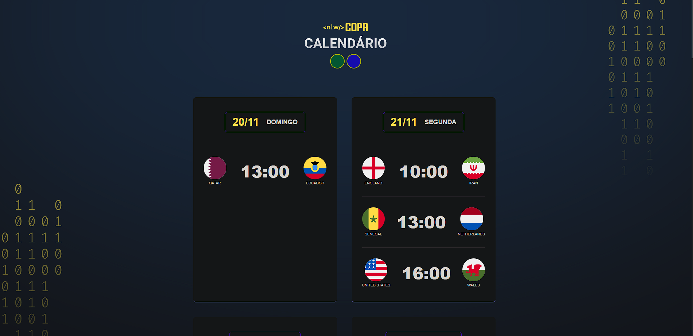

# NLW #10 Copa

> 💻 Calendario com as datas e horarios dos Jogos a Copa do Mundo 2022, feito em HTML, CSS e JavaScript no evento promovido pela Rocketseat 

[Clique aqui para acessar](https://rafagnx.github.io/NLW-COPA/)

## 🛠 Tecnologias Utilizadas:
- [HTML](https://developer.mozilla.org/pt-BR/docs/Web/HTML)
- [CSS](https://developer.mozilla.org/pt-BR/docs/Web/CSS)
- [JavaScript](https://developer.mozilla.org/pt-BR/docs/Web/JavaScript)

## ⚙ Referências:
- [Layout](https://www.figma.com/community/file/1169028052212317700)
- [Dados dos Jogos](https://www.google.com/search?q=copa+do+mundo+calend%C3%A1rio+&hl=en&sxsrf=ALiCzsZoKWNkDcZB5r6yUZ_gOOckX6sfew%3A1666552817096&ei=8ZNVY5S4BZHM1sQPhYyY8AI&ved=0ahUKEwjU9KWFiff6AhURppUCHQUGBi4Q4dUDCA8&uact=5&oq=copa+do+mundo+calend%C3%A1rio+&gs_lcp=Cgdnd3Mtd2l6EAMyBAgjECcyCAgAEIAEEMsBMggIABCABBDLATIICAAQgAQQywEyCAgAEIAEEMsBMggIABCABBDLATIGCAAQFhAeMgYIABAWEB4yBggAEBYQHjIGCAAQFhAeOgoIABBHENYEELADOg0IABDkAhDWBBCwAxgBSgQITRgBSgQIQRgASgQIRhgBUKgDWKgDYIkGaAFwAXgAgAGhAYgBoQGSAQMwLjGYAQCgAQHIAQ3AAQHaAQYIARABGAk&sclient=gws-wiz#sie=lg;/m/0fp_8fm;2;/m/030q7;mt;fp;1;;;)

## :memo: Licença

Esse projeto está sob a licença MIT.
Rocketseat

---

Feito com ♥ by RafaGnx 
## ♥ Contato

 
  
   
